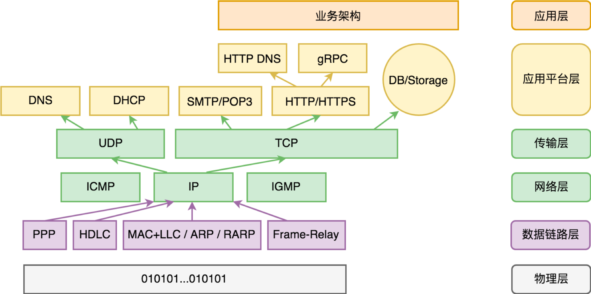
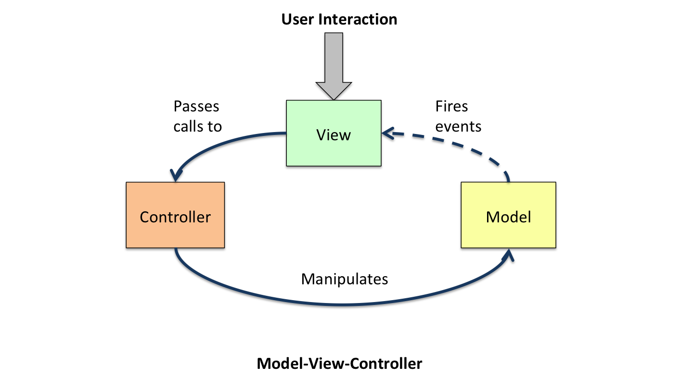
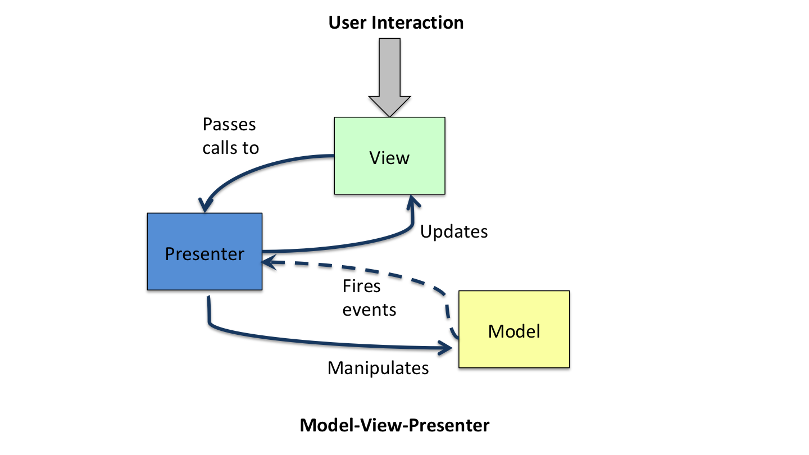
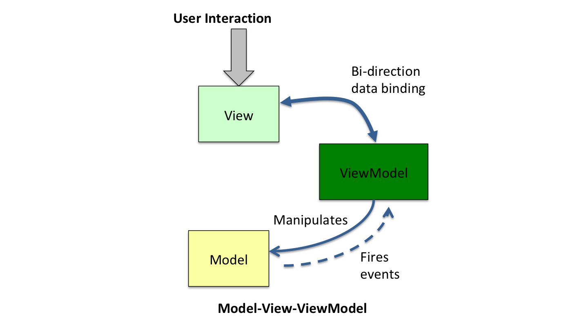

# 许式伟的架构课

## 基础平台篇

### 01 架构设计的宏观视角

#### 为什么要建立宏观视角

宏观的全局掌控能力 => 不一定需要真的实现 重点是弄懂核心思想是什么

#### 应用程序的基础架构

为何电脑能够完成这么多复杂而多样化的工作？=> 第一是可编程性。第二是可接入性/开放性，即开放设计的外部设备支持。

**冯·诺依曼计算机体系** => 直接用机器指令编写软件太累，而且这些机器指令像天书一样没人看得懂，没法维护。

=> **编程语言 + 编译器** => 多个软件在同一个电脑上怎么共处。多个软件大家往同一个存储地址写数据冲突怎么办？一起往打印机去发送打印指令怎么办？有的软件可能偷偷搞破坏怎么办？

=> **操作系统** 解决软件治理问题 + 基础编程接口问题

**基础架构解决的是与业务无关的一些通用性的问题**，这些问题往往无论你具体要做什么样的应用都需要面对。而且，基础架构通常以独立的软件存在，所以也称为基础软件。例如，我们熟知的 Linux、Nginx、MySQL、PHP 等这些软件都属于基础软件，这些基础软件极大地降低了应用开发的难度。在今天软件服务化的大趋势下，很多基础软件最终以互联网服务的方式提供，这就是所谓的“云计算”。

#### 完整的程序架构

基础架构强大 => 只需要关注应用本身的业务问题 => 设计应用架构

**服务端应用程序**

业务架构

应用程序框架及各类基础库

中间件基础软件（Nginx、MySQL）

操作系统 + 编程语言

冯诺伊曼体系架构

**客户端应用程序**

业务架构

跨平台应用框架及各类基础库

浏览器 + HTML/XML、CSS、JS/WebAssembly

操作系统 + 编程语言

冯诺伊曼体系架构

浏览题比较特殊，可以看作操作系统之上的操作系统，它是第一个想消除客户端的多样性，并且跨平台提供统一编程接口的。一旦浏览器非常流行，会导致底层操作系统管道化，对于操作系统厂商其实是一种威胁。

**基础架构**

应用软件

编程语言操作系统相关的标准库

操作系统基础库（动态库）        编程语言的标准算法库

操作系统                     编程语言

编程语言核心文法及内置库

CPU

### 02 基石：冯诺伊曼体系结构

中央处理器 + 存储 + 输入输出设备

#### 解剖架构的关键点是什么？

1. 需求。作用是什么？作用范围？为什么？

2. 接口。如何连接？约束条件？

架构的第一步是需求分析。从需求分析角度来说，关键要抓住需求的稳定点和变化点。需求的稳定点，往往是系统的核心价值点；而需求的变化点，则往往需要相应去做开放性设计。

### 03 汇编：编程语言的诞生

汇编语言。表达能力上的效率优化：

* 用文本符号（symbol）表达机器指令

* 用文本符号（symbol）表达要操作的内存地址，并支持内存地址的自动分配

* 用文本符号（symbol）表达要调用的函数（function，也叫“过程 -procedure”）地址

* 用文本符号（symbol）表达要跳转的目标地址。

汇编语言的出现早于操作系统。

BIOS启动程序。一般包括以下内容：

* 存储设备的驱动程序，用以识别常规的外置存储设备，比如硬盘、光驱、U 盘。基础外部设备的驱动程序，比如键盘、鼠标、显示器（显卡）。

* 设备和启动配置的基础管理能力。

* 在外置存储上执行程序的能力（中央处理器只支持在内存上执行程序，当然它也为在外置存储执行程序提供了一些支持，比如内存页缺失的中断处理）。

* 将执行权转移到外置存储（第一次安装操作系统的时候可能是光驱甚至是网络存储，平常通常是硬盘）上的操作系统启动程序。

“计算”需求的多样性只需要通过调整计算机主板上的 BIOS 程序，乃至外置存储中的操作系统启动程序就可以实现，而不必去修改中央处理器本身。

### 04 编程语言的进化

#### 编程范式的进化

* 过程式。结构体 + 过程。

* 函数式。变量不可变，函数无副作用。数据结构组织上会不太一样，以防止低效执行。

* 面向对象。对象 + 对象方法。

* 面向连接。Go 自己发明出来的范式名称。研究人与人如何组合，研究代码与代码之间怎么组合。

面向对象优势：接口清晰易懂、封装、多态、继承。

面向对象创造性地把契约的重要性提高到了非常重要的高度，但这还远远不够。这是因为，并不是只有对象需要契约，语言设计的方方面面都需要契约。比如，代码规范约束了人的行为，是人与人的连接契约。如果面对同一种语言，大家写代码的方式很不一样，语言就可能存在很多种方言，这对达成共识十分不利。所以 Go 语言直接从语言设计上就消灭掉那些最容易发生口水的地方，让大家专注于意图的表达。

#### 其他方面的进化

工程能力的完善：

* 包（package），即代码的发布单元。

* 版本（version），即包的依赖管理。

* 文档生成（doc）。

* 单元测试（test）。

#### 语言对架构的影响

站在唯技术论的角度，业务架构与语言无关，影响的只是模块规格的描述语法。但语言的选择在实践中对业务架构决策的影响仍然极其关键。原因之一是开发效率。原因之二是后期维护。

### 05 操作系统

编程语言出现 => 软件开发效率提升 => 催生软件治理的需求：

* 多任务。多个软件如何同时运行？

* 内存管理、文件系统。多个软件如何共同使用计算机上的存储空间

* 设备管理的需求。多个软件如何共同使用同一个外部设备。

* 进程间通讯、共享内存的需求。多个软件如何相互通讯，如何进行数据交换？

* 安全管理的需求。病毒、恶意软件如何治理？

#### 操作系统的启动过程

计算机加电启动后，中央处理器（CPU）会从一个固定的存储地址加载指令序列执行。通常，这个固定的存储地址指向计算机主板的 ROM 上的一段启动程序（BIOS）。

这段启动程序通常包含以下这些内容：

* 存储设备的驱动程序，用以识别常规的外置存储设备，比如硬盘、光驱、U 盘。

* 基础外部设备的驱动程序，比如键盘、鼠标、显示器。

* 设备和启动配置的基础管理能力。

* 支持执行外置存储中引导区的机器代码程序。

* 跳转到外置存储引导区的固定地址，把执行权交给该地址上的引导程序。

引导区的引导程序有长度限制，只能做非常少的事情。在常规情况下，它只是简单地跳转到真正的操作系统的启动程序，但有时计算机上安装了多个操作系统，此时引导程序会提供菜单让你选择要运行的操作系统。

#### 操作系统的需求演进

原始：降低软件开发的负担 => 软件治理 + 提供基础编程接口

从商业价值来说，操作系统是基础的刚需软件，也是核心的流量入口。

现代操作系统，如iOS、Android、浏览器等，通过账号——支付——应用市场这样的收税模式，构建商业闭环，将流量变现。

#### 操作系统的边界

操作系统与硬件的关系。移动时代，操作系统厂商不做硬件，效果不会如PC一样理想，参见 Android & iOS。

操作系统和浏览器的关系。边界越来越模糊。问题是：操作系统、浏览器和（互联网）搜索引擎的关系是什么；移动时代的浏览器会是什么样的；它和操作系统的关系又如何相处？

### 07 内存管理 => 软件运行机制

#### 内存管理的需求

* 如何分配内存（给运行中的软件，避免它们发生资源争抢）

* 如何运行外置存储（比如硬盘）上的软件？

#### 计算机运行机制

BIOS => 引导区引导程序 => OS引导程序 => OS Shell程序 => 软件们

计算机如何运行外置存储上的软件？

CPU的两种工作模式：实模式 & 保护模式。

##### 实模式

在实模式操作系统下，所有软件包括操作系统本身，都在同一个物理地址空间下。

如何分配内存？其一，把操作系统内存管理相关的函数地址，放到一个大家公认的地方，每个软件要想申请内存就到这个地方取得内存管理函数并调用它。其二，把内存管理功能设计为一个中断请求。所谓中断，是 CPU 响应硬件设备事件的一个机制。当某个输入输出设备发生了一件需要 CPU 来处理的事情，它就会触发一个中断。

计算机如何运行外置存储上的软件？=> 把软件完整从外置存储读入到内存然后执行它。不过，在执行前需要把浮动地址固定下来。为什么会有浮动地址？因为软件还没有加载到内存的时候并不知道自己会在哪里，所以有很多涉及数据的地址、函数的地址都没法固定下来，要在操作系统把它加载到内存时来确定。

##### 保护模式

实模式的问题？其一是安全性。操作系统以及所有软件都运行在一起，相互之间没有隔离。其二是支持的软件复杂性低，同时可运行的软件数量少，比如单个程序很大，或者多个加在一起很大。

保护模式下，内存访问不再是直接通过物理内存，而是基于虚拟内存。

通过这个虚拟内存的机制，操作系统并不需要一上来就把整个软件装进内存中，而是通过缺页中断按需加载对应的程序代码片段。多个软件同时运行的问题也解决了，内存不够用的时候，就把最久没有用过的内存页淘汰掉，腾出物理内存出来。在实模式下的浮动地址的问题也解决了，软件可以假设自己代码加载的绝对地址是什么，不需要在加载的时候重新调整 CPU 指令操作的地址。

### 08 操作系统内核与编程接口

#### 操作系统内核

所谓操作系统内核，其实就是指那些会向我们写的应用程序提供系统服务的子系统的集合，它们管理着计算机的所有硬件资源，也管理着所有运行中的应用软件（进程）。在保护模式下，CPU 引入了代码执行权限等级。

操作系统内核的代码和数据，不只为所有进程所共享，而且在所有进程中拥有相同的地址。这样无论哪个进程请求过来，对内核来说看起来都是一次本进程内的请求。从单个进程的视角，中断向量表的地址，以及操作系统内核的地址空间是一个契约。有了中断向量表的地址约定，用户态函数就可以发起一次系统调用（软中断）。

既然操作系统内核和我同属一个地址空间，我是否可以跳过中断，直接访问调用内核函数？当然不能。虚拟内存中存在内存页保护机制。内存页可以设置 “可读、可写、可执行” 三个标记位。操作系统内核虽然和用户进程同属一个地址空间，但是被设置为“不可读、不可写、不可执行”。

#### 编程接口

大部分高级语言都实现了操作系统编程接口的封装。操作系统（内核）有六大子系统：存储管理、输入设备管理、输出设备管理、进程管理、网络管理、安全管理。除了安全管理是一个“润物细无声”的能力外，其他子系统都会有所包装。

从操作系统的角度来说，它仅仅提供最原始的系统调用是不够的，有很多业务逻辑的封装，在用户态来做更合适。但是，它也无法去穷举所有的编程语言，然后一一为它们开发各种语言的基础库。那怎么办？=> 动态库。几乎所有主流操作系统都有自己的动态库设计。

动态库本质上是实现了一个语言无关的代码复用机制。它是二进制级别的复用。大部分语言会选择直接调用动态库的函数并进行适度的语义包装，以此实现自己的标准库。=> *问题：编程语言如何使用这个二进制文件？*

动态库核心需要考虑的东西：

* 浮动地址。动态库本质上是在一个进程地址空间中动态加载程序片段，这个程序片段的地址显然在编译阶段是没法确定的。

* 导出函数表。动态库需要记录有哪些函数被导出（export），这样用户就可以通过函数的名字来取得对应的函数地址。

#### 操作系统与编程语言

编程语言和操作系统是两个非常独立的演化方向，却又彼此交融。操作系统诞生离不开编程语言，但操作系统又是编程语言迭代依赖的基础设施。

一些问题：

1. 先有编程语言，还是先有操作系统？

先有编程语言。

2. 编程语言怎么做到自举的（比如用 C 语言来实现 C 语言编译器）？

机器码 => 汇编语言编译器 => 汇编语言写的 C 编译器程序 => C 语言重写上述编译器程序

2. 操作系统开发的环境是什么样的，能够做到操作系统自身迭代本操作系统（自举）么？

可以。先通过**交叉编译**得到新系统，稳定后再基于新系统做后续迭代开发。

### 09 外存管理与文件系统

外置存储的区别只在于质量，而非功能，对于操作系统来说，管理它们的方式是一样的。

外置存储设备依据其功能特性不同，可以分为如下三类。

* 顺序读写型。如：磁带。

* 随机只读型。更准确说是单次完整写入多次读取型，也就是每次写数据都是整个存储介质一次性完整写入数据。如：光盘（含可擦写光盘）。

* 随机读写型。如：软盘、硬盘、U 盘、SSD 等等。最常见。

#### 如何管理外存？

外存是持久存储，目的是储存。内存是临时存储，目的是为 CPU 计算服务。所以它们的管理和数据格式必然是不同的。

对于外部存储的管理，希望写到存储中的数据格式是“自描述的”，这样可以随时查看之前写了哪些内容，什么时候写的。

**所以有了文件系统。**

#### 文件系统

文件系统把存储设备中的数据组织成为了一棵树。节点可以是目录（也叫“文件夹”），也可以是文件。树的根节点为目录，我们叫根目录。如果是目录，那么它还可以有子节点，子节点同样可以是子目录或文件。文件则是叶节点，保存我们希望存储的资料。每个节点会提供一些描述性的元信息，比如何时创建、何时更改、甚至操作日志。

各种类型外存的常见文件系统。（略）

设计思路基本相似。大部分现代文件系统都基于日志（journal）来改善文件系统的防灾难能力（比如突然断电，或不正常的 unmount 行为），基于 B 树或 B+ 树组织元数据。

对于随机读写型的存储设备，操作系统往往还支持对其进行分区。

一般来说，拿到一块存储设备，我们往往第一步是对其进行分区（当然也可以省略）。第二步是对每个分区进行格式化。所谓格式化就是给这个分区生成文件系统的初始状态。格式化最重要的是标记分区的文件系统格式（用来告诉别人这个分区是数据是怎么组织的），并且生成文件系统的根目录。第三步是把该分区挂载（mount）到操作系统管理的文件系统名字空间中。完成挂载后，该分区的文件系统管理程序就工作起来了，我们可以对这个文件系统进行目录和文件的读取、创建、删除、修改等操作。

#### 所以 如何使用外存？

操作系统命令行工具 / 系统调用 => 高级语言封装

路径冲突？

虚拟内存支持：物理内存不足时，操作系统会利用外存保存一些很久没用的内存页数据。比如，在 UNIX 系的操作系统中，操作系统为此分配了一个磁盘分区叫 swap 分区，专门用于内存页的保存和恢复。在 Windows 操作系统中则通过一个具有隐藏属性的 .swp 文件来实现。

### 10 输入输出设备：交互的演进

输入设备：键盘、鼠标、摄像头、麦克风。

输出设备：显示器（窗口系统 & 绘制子系统 & 事件管理系统）、音响（覆盖原则，混音处理，允许禁止播放其他软件）、打印机（打印缓冲队列，避免多个软件相互等待）。

GDI graphic device interface，一般在操作系统里对应绘制能力，涉及：

* 2D 图形相关。包含 Path(路径)、Brush(画刷)、Pen(画笔) 等概念。

* 3D 图形相关。包含 Model(模型)、Material(材质)、Lighting(光照) 等概念。

* 文本相关。包含 Font(字体) 等概念。而字体又分点阵字体和 TrueType 字体。TrueType 字体的优势是可以自由缩放。今天我们见到的大部分字体都是 TrueType 字体。

* 图像处理相关。包含 Bitmap(位图) 对象及常见图像格式的编解码器 (Encoder/Decoder)。

总体而言，交互在朝着自然 Nature 和智能 Intelligent 的方向发展。

### 11 多任务：进程、线程、协程

#### 如何做到多任务？

关于任务：任务是什么？任务的状态数据表征？什么时候切换？

任务状态数据：一堆寄存器的值。包括存储当前执行输入、输出、函数的寄存器，储存地址映射表的寄存器等。

物理层面：多 CPU，或者单 CPU 多内核。对于用户设备，更多选择后者，节省硬件空间。对于服务器，会两者结合。

单核如何多任务？=> 分时系统。

#### 为何会有多种类型的执行体？

执行体 地址空间 调度方 时间片调度 主动调度

进程 不同执行体不同 操作系统内核 基于时钟中断 系统调用

线程 不同执行体共享 操作系统内核 基于时钟中断 系统调用

协程 不同执行体共享 用户态 一般不支持 包装系统调用

进程是隔离单位。线程的出现，则是因为操作系统发现同一个软件内还是会有多任务的需求，这些任务处在相同的地址空间，彼此之间相互可以信任。协程并不是操作系统内核提供的，它有时候也被称为用户态线程。这是因为协程是在用户态下实现的。

#### 为什么会出现协程？

实现高性能的网络服务器的需要。

网络服务器的工作内容：处理大量并行的 IO。包括与客户端之间的 IO；响应请求过程中的本地/网络 IO。

=> 操作系统提供的标准 IO 开销：系统调用机制产生的开销；数据多次拷贝的开销（数据总是先写到操作系统缓存再到用户传入的内存）；因为没有数据而阻塞，产生调度重新获得执行权，产生的时间成本；线程的空间成本和时间成本（标准 IO 请求都是同步调用，要想 IO 请求并行只能使用更多线程）。其中系统调用机制产生的开销并不像想象中高，因为本质是函数调用。

=> 线程的开销如何？

  * 时间成本：切换开销，它主要是寄存器保存和恢复的成本，可腾挪的余地非常有限。调度开销，它主要是如何在大量已准备好的执行体中选出谁获得执行权。同步与互斥成本。
  
  * 空间成本：执行体的执行状态；TLS（线程局部存储）；执行体的堆栈。

=> 一些主流的提高服务器吞吐能力的做法，都是为了减少线程的数量。
  
  * 比如：epoll（Linux）或 IOCP（Windows）机制。
  
  * 同样由于为了减少线程数，一些库，比如 NodeJS libevent 会基于这两种机制去封装跨平台的异步 IO 编程模型。

=> 协程

  * 目的：回归同步 IO 的编程模式 & 降低执行体的空间成本和时间成本。

=> 协程库需要做什么？

  * 协程的创建和执行；协程调度；协程间同步、互斥、通讯；协程系统调用包装，比如网络 IO 请求。

  * 最复杂：管理堆栈。需要按需增长。作者认为 Erlang 和 Go 实现了比较完备的协程库。

#### 进程间协同

启动。从一个进程中启动另一个。

同步与互斥。主流操作系统支持了锁（Mutex）和信号量（Semaphore）。进程间的同步与互斥原语并没有进程内那么丰富，甚至没那么牢靠，这是由于进程可能会异常终止。进程间的锁，语义上和进程内没有什么区别，只不过标识互斥资源的方法不同。Windows 最简单，用名称（Name）标识资源，iOS 用路径（Path），Linux 则用共享内存。

通讯。

  * 共享资源：文件系统；剪贴板。

  * 基于网络收发消息。套接字。

iOS 有何特别？=> 去掉了绝大多数进程间协同机制。

  * 软件不需要启动多份实例。一个软件只需启动一个进程实例。
  
  * 大部分进程间的协同机制都是多余的。你只需要能够调用其他软件的能力（URL Scheme）、能够互斥、能够收发消息就够了。

#### 进程内执行体的系统：互斥、同步、通讯

进程内的两类执行体：线程、协程。

互斥：锁。

同步：常见的是“等待组”机制。把一个大任务分解，分配给多个执行体并行去做，等待一起做完。

通讯：管道。

### 14 网络

#### 网络分层

OSI 模型：应用层、表示层、会话层、传输层、网络层、数据链路层、物理层。

=> 简化一些：应用层、传输层、网络层、数据链路层、物理层。

DNS DHCP

UDP -> DNS DHCP; TCP

IP -> UCP & TCP; ICMP IGMP

PPP HDLC ARP/RARP/MAC+LLC Frame-Relay -> IP

DNS：域名 => IP 地址查询。

DHCP：初始入网，分配 IP 地址，得到默认网关地址和 DNS 服务器地址。

ARP：局域网（特指以太网）中解析远程主机 IP 地址对应的 MAC 地址。

RARP：MAC 地址到 IP 地址解析。已被 DHCP 替代。

ICMP：检测网络状况。常见应用：ping & traceroute。

#### 数据传输过程

三种情况：

1. 源和目标在同一个局域网内，中间通过交换机连接，使用以太网协议。

  * 交换机会通过不断学习，储存 MAC => 交换机端口 的地址映射表。

  * 交换机工作过程。学习，泛洪（对所有端口广播查找目标主机），转发，过滤（源和目标端口相同），老化（清除高于时间阀值的映射数据）。

2. 源和目标都有公网 IP，中间经过路由器和交换机关联。

  * 路由器：路由算法、路由表。封包转换问题。

3. 源和目标至少有一方在局域网内且只有私有 IP 地址，它们中间经过若干交换机和路由器相连。

  * NAT（Network Address Translation，网络地址转换）技术。它的原理比较简单，临时建立了一个双向的映射表 actualAddr:port1 <=> routerAddr:port2。port2 可能随机分配。

  * NAT 网关并不一定是公网网关（路由器），它可以由局域网内任何一台有公网 IP 的主机担当。但显然如果公网网关担当 NAT 网关，链路的效率会高一点。

4. 源和目标都在不同的局域网内，且都没有公网 IP。

  * 想要直接通讯，需要中间人服务器去牵线搭桥，并且要求目标主机的 NAT 网关是 Full cone NAT，即一对一（one-to-one）NAT 网关时才成立。首先获得目标主机到网关的双向映射，然后把网关方地址告诉源主机，源主机直接往网关方地址发包。后者是对根据映射转发不做限制，不看之间建立映射的跟现在发的是不是同一台。

  * 其他 NAT 类型会对回包主机有约束。在这种情况下无法直接通讯。

### 15 网络应用程序

网络应用程序的完整视图

应用层协议。HTTP / HTTPS。

应用层网关。Nginx / Apache。

HTTP 的优势在哪里？开放的协议头设计。规范了业务的表达范式（真的吗？）。规范了应用层的路由方式，即域名 + 资源路径（真的吗？）。

TCP/IP 编程接口。

### 16 安全

1. 软件本身运行安全，病毒、木马。iOS 把软件发布变成一个封闭环境，通过特定平台，进行安全扫描。

2. 软件信息安全，隐私数据。iOS 引入了沙盒系统，确保软件之间文件系统隔离，相互之间不能访问对方保存在磁盘上的文件。且会对涉及敏感信息的系统权限进行管控。

3. 网络环境。被窃听、篡改、钓鱼等。

  * 中间人问题 => 数字签名技术。检查内容是否真的是某个人写的。

  * 加密。对称加密和非对称加密。

#### HTTPS 如何工作？

网站部署前，找权威机构为自己签发数字证书，证明域名与网站公钥的对应关系。

1. 客户端向网站请求其数字证书。

2. 网站返回数字证书。

3. 客户端收到证书，使用权威机构提供的公钥，验证证书确实由该权威机构发布。

4. 检查域名<->网站公钥对应关系是否一致。若一致则可以先使用网站公钥非对称加密自己随机生成的临时密钥，发给网站后，双方通过临时密钥，对称加密，相互通信。

### 17 需求分析

* 用户是谁。面向什么人群。

* 用户原始需求是什么？最核心问题是哪几个？

* 已经有哪些玩家在里面？上下游有哪些类型的公司，在我们之前，用户是怎么解决他们的问题的？我们的替换方案又是怎样的？

* 我们的产品创造的价值点是什么？

* 用户需求潜在的变化在哪些地方？区分出需求的变化点和稳定点。

如何做需求分析？

1. 心系客户。

2. 追问，找到根源需求。

3. 理清需求后，整理归纳。一方面，将需求分别归类到不同的子类别中。另一方面，形成需求的变化点和稳定点的基本判断。

需求分析的目标和最终结果，是形成清晰的产品定义。产品定义，首先，需要明确产品中有哪些元素，或者叫资源，以及这些资源的各类操作方式。其次，需要对产品如何满足用户需求进行确认，比如特定行业可能需要整合相应的行业解决方案。最后，产品定义还需要考虑市场策略，我们的产品如何进入市场，和既有市场格局中的其他主流解决方案的关系是什么样的。

用思考的方式去记忆，而不是用记忆的方式去思考。

## 桌面开发篇

### 20 桌面开发的宏观视角

桌面系统的演进方向主要是交互范式的迭代。

命令行交互 => 字符界面 => 图形界面 => 智能交互（语音）

### 21 图形界面程序的框架

事件。全局事件队列，由操作系统负责填入。

窗口与事件响应。常见的事件响应机制：事件处理类 EventHandler，由窗口类继承；委托 delegate，比如 element 交给使用其的地方去实现 onclick 方法。

事件分派。event dispatch loop 取消息、分派。如何决定该由谁响应事件？EventHandler Chain，不同事件的分派过程并不一样。

绘制。GDI 是操作系统性能要求最高、最耗电的子系统。GDI 优化往往通过硬件加速来完成，真正的关键角色是硬件厂商。

通用控件。操作系统提供，便于开发。各种实现细节上的不同会成为跨平台的坑。

### 22 桌面程序的架构

#### MVC

* Model (part of input)

  * in: next data

  * out: data changed event

* Controller (process) 

  * in: previous model + changed event from view

  * out: next model

* View (part of input, final output)

  * in: event from user; event from model

  * out: next view

#### MVC 的变种

=> MVP。model change 并不直接影响 view，而是通过触发 event 告知 controller（presenter），由 controller 来更新 view。

=> MVVM。几种解释：

  * Controller 中处理大部分业务逻辑，即胖 Controller。=> ViewModel 是 Controller 的瘦身。

  * Model 中处理大部分业务逻辑，即胖 Model。=> ViewModel 是 Model 的瘦身。将格式化的 Model 数据转移，避免 Model 知道 View 的实现细节。

  * View 的局部优化问题足够复杂时（？），ViewModel 从 View 中分离，辅助进行局部更新。

*维持 Model 与 ViewModel 层的数据一致性的模块，叫排版引擎。*

#### 如何理解 Model？

Model = data？=> Model = 承载业务逻辑的对象模型

Model 层的稳定点：负责业务需求的内核逻辑。=> 与平台无关，越厚越好。

Model 层的变化点：如何与多种交互场景通信。=> 事件回调解决。

#### 如何理解 View？

View 层的职责：绘制界面，响应用户事件。

View 层实现要考虑的问题：

  * 不一定负责生成所有 View => 有些可能由 Controller 临时生成。

  * 可能需要非常友好的 delegate 机制。

  * 与 Model 关系紧密，可能需要 Model 专门提供用于 View 显示的只读接口。

  * 性能：大多数情况下不能数据一变就直接重绘，需要做局部优化。=> MVVM

#### 如何理解 Controller？

Controller 层的职责：响应用户交互。=> 可以被正交分解。

#### 如何提供二次开发接口？

MVC 是很好的模型来支持用户交互。但这不是桌面程序面临的全部。另一个很重要的需求是提供应用程序的二次开发接口。

作者认为在 ViewModel 层实现最合适。Model 层可能会缺失一些东西。没懂他说的缺失的 Selection 是指什么。

### 23 Web 开发

#### 浏览器

浏览器带来的改变从两个角度看：

1. 商业价值

  * 软件服务化。单机软件转为云服务。

  * 随时发布。改变了软件迭代速率。

  * 跨平台。一定程度上消除了不同平台的差异性。

2. 界面开发框架

  * 窗口系统不复存在。只有一个窗口，所有元素都是虚拟视图。

  * 窗口绘制机制改变。从 GDI 的绘制式改为 HTML + CSS 的声明式。

  * 语言限制。虽然有 WebAssembly 的尝试，最主要还是 JavaScript。

  * 新的服务架构 B/S。

#### 小程序

成功原因：移动时代最佳的浏览器是 IM（即时通讯），IM 有极强的封闭性，以此构建 App 生态，下一代 OS。

与传统 Web 开发的不同：更像 Native 程序在线化，而不是 PC Web 移动化。

存在问题：标准不统一。平台方的权力太大，权限边界究竟在哪里。

#### PWA

与小程序有何不同？其一，演进思路不同。PWA 基本上以兼容并对 Web 进行逐步改造升级为导向。其二，关注焦点不同。PWA 更技术化，它很大的精力重心放在如何让 PWA 在断网情况下和本地应用有更一致的体验。其三，PWA 并没有中心化的 AppStore，它更像是一项技术标准，而不是一个封闭的操作系统。不会形成 OS 闭环。

#### 跨平台桌面程序和 Web 开发

跨平台桌面程序开发的关键难点在于平台差异性。差异性体现在两个方面：操作系统 & 屏幕尺寸。

Web 开发的复杂性在于：需要支持多用户，数据不再保存在 Client 端。更高的数据可靠性要求。更多可能的分工安排，比如胖前端/胖后端。

Client 端的架构变化。MVC 框架对应于浏览器：View 层由浏览器实现，HTML + CSS 提供 ViewModel 层，JS 逻辑属于 Presenter 层。

Server 端的架构变化。Web 开发，我们同样需要二次开发接口，只不过这个二次开发接口不再是在 Client 端完成的，而是在 Server 端完成。Server 端支持直接的 API 调用，以支持自动化（Automation）方面的需求。

### 25 桌面开发的未来

一些关键点：

通用跨平台如何做到。对操作系统要求最小化，在自己的用户态构建界面系统。=> 关注 Flutter。

编程手法。大趋势是用声明式语法。可能需要重新梳理。=> 关注 React Native 和 Swift UI。

### 26 概要设计

概要设计/系统设计。即分解子系统，明确子系统的职责边界和接口协议。

划分优劣的评判标准？

  * 功能的使用界面（或者叫接口），应尽可能符合业务需求对它的自然预期。

  * 功能的实现要高内聚，功能与功能之间的耦合尽可能低。
  
    * 外部依赖分两种。一种是对业务无关的基础组件依赖，一种是对底层业务模块的依赖。关注重点在业务模块依赖，依赖少体现在对底层业务的依赖是 “通用” 的，依赖个数少，使用频次低。基础组件依赖看重组件成熟度，和稳定程度。

如何分解？

  * 收集足够的上下文。分类归纳，得到子系统。

  * 最子系统进一步拆分，确定子系统所有模块的职责和接口。

  * 产出原型代码。全局系统性风险的消除，并且给了每个子系统或模块的负责人一个更具象且确定性的认知。

关心的问题是：

  * 每个子系统负责什么事情？

  * 它依赖哪些子系统？它能够少知道一些子系统的存在么？

  * 它们是通过什么接口耦合的？这个接口是否自然体现了两者的业务关系？它们之间的接口是否足够稳定？

能用代码约束的事情，最好不要在文档中去约束。依赖选择上，倾向于去依赖更稳定的组件和接口。

### 27 桌面开发篇总结

特点：基础平台种类多迭代快，知识有效期短。技能要求门槛低，天花板高，工程项目管理难度高。

## 服务端开发篇

### 34 服务端开发的宏观视角

桌面开发 => 交互方式迭代。服务端开发 => 与 OS 分离，向数据靠拢。

服务端需求演进的根源：服务对象从一个变为一群。从而要求 => 规模。连续服务时长。服务质量。

服务端程序的宏观体系架构：

客户端

负载均衡

业务架构

服务端操作系统 + 编程语言

DB/Storage

### 35 流量调度与负载均衡

流量相关概念

  * 连接数/并发数。同一时间在服务中的请求数。

  * IOPS。每秒完成的一问一答数量。

  * 流量，入向 & 出向。IOPS * 请求包平均大小，IOPS * 应答包平均大小。

流量调度策略

  * DNS。一个域名对应多个 IP。

    * 不足：更新升级不方便。DNS 解析中存在层层缓存，调度效果差。

  * 网络层。如 LVS Linux Virtual Server。

    * 优势：通用性强、性能高。

    * 不足：若某一台业务服务器实例宕机，而 LVS 调度器未感知，则这段时期的请求均会失效。

  * 应用层。如应用层网关 Nginx、Apache。

    * 客户端 <=> 网关（调度算法） <=> 服务器实例

### 36 业务状态与存储中间件

客户端和服务端程序的相似和不同？

对于客户端，用户交互事件触发业务状态变更，业务状态存储在内存；对于服务端，网络 API 请求触发业务状态变更，业务状态持久化存储。

存储中间件

常见：键值存储（KV-Storage）；对象存储（Object Storage）；数据库（Database）；消息队列（MQ）；倒排索引（SearchEngine）等。

最早出现的存储中间件是数据库。对于服务端来说，存储中间件至关重要。它不只是极大地解放了生产效率，也是服务端的性能瓶颈所在。

容灾级别

  * 单机 => 多机相互热备（主从结构由来）

  * 单机 => 手工分库分表 => 分布式

  * 单机房 => 跨机房

### 37 键值存储与数据库

#### 数据库种类

* 关系型。强 Schema。

* 非关系型。大部分无 Schema。好处是使用门槛低，升级数据格式方便。不好之处在于，质量保障体系弱化，数据可能被弄脏而不自知。

* 键值存储。以 Cassandra 为代表。从使用的角度来说，可以认为是数据库的特例。数据库往往是允许设定多个索引字段的，而键值存储明确只有唯一索引。

#### 事务

是否支持事务是一个艰难选择。从需求角度来说，事务功能非常强大，没道理不去支持。从实现角度来说，事务支持带来极大的负担，尤其是在分布式数据库的场景。

ACID

* 原子性（Atomicity）：在整个事务中的所有操作，要么全部完成，要么全部不做，没有中间状态。对于事务在执行中发生错误，所有的操作都会被回滚，整个事务就像从没被执行过一样。

* 一致性（Consistency）：事务的执行必须保证系统的一致性。这一点拿转账为例最容易理解。假设 A 有 500 元，B 有 300 元，如果在一个事务里 A 成功转给 B 50 元，那么不管并行发生了其他什么事，A 账户一定得是 450 元，B 账户一定得是 350 元。

* 隔离性（Isolation）：事务与事务之间不会互相影响，一个事务的中间状态不会被其他事务感知。

* 持久性（Durability）：一旦事务完成了，那么事务对数据所做的变更就完全保存在了数据库中，即使发生停电，系统宕机也是如此。

锁

#### 主从结构

考虑 业务可用性（是否正常工作） + 数据持久性（是否会被异常丢失） => 多副本存储数据 => 数据一致性问题

解决方法之一：主从结构 Master-Slave。一主多从模式，所有写操作都发往主（Master），所有从（Slave）都从主这边同步数据修改的操作。

并非所有读操作都可以被分担，有些要求读到最新的数据。

主挂掉时 => 选举行为 => 一半节点同意 => 集群数量为奇数较好 避免选不出的情况 => 为避免版本回退 写操作需要确保至少有一个从节点收到了最新数据

#### 分布式

多副本保障可用性和持久性后 问题 =>

* 单节点物理存储容量有限

* 主承受读写压力仍然很大

=> 分布式：数据分片存储到多台设备上的分片服务器一起构成一个单副本的数据库。

常见分片方式：哈希分片 hash based sharding & 范围分片 range based sharding。

扩容缩容 => 均需重新分片 => 数据迁移 => 数据迁移阶段的数据访问问题

分布式存储领域CAP理论：三个目标不可兼得，只能取其二。

* 数据一致性 (Consistency)：如果系统对一个写操作返回成功，那么之后的读请求都必须读到这个新数据；如果返回失败，那么所有读操作都不能读到这个数据。

* 服务可用性 (Availability)：所有读写请求在一定时间内得到响应，可终止、不会一直等待。

* 分区容错性 (Partition-tolerance)：在网络分区（变成两个相互独立的集群）的情况下，被分隔的节点仍能正常对外服务。

### 38 文件系统与对象存储

#### 异常存储才是存储的业务逻辑

业务程序将状态持久化工作交给了存储中间件，自己重点关注业务的正常分支。存储系统需要花费绝大部分精力在各种异常情况的处理上。

#### 文件系统

服务端开发会把多媒体数据存到文件系统而非数据库里，但文件系统并非最适合用于存储这些数据，原因在于：

* 伸缩性：单机容量有限

* 性能瓶颈： 文件数目达到临界点后，性能会快速下降

* 可靠性/持久性：单机文件系统 => 单副本 数据需要冗余以避免数据丢失

* 可用性：机器宕机数据无法读写

非结构化数据会有最大的存储规模 由此小概率下的数据丢失事件 也会变成必然事件

Google GFS、Hadoop HDFS

#### 对象存储

非结构化数据最佳的存储方式是键值存储 => 对象存储

对象存储并不存在目录 Directory 这样的概念。

#### 存储成本和持久性

存储成本最大的关联因素：存储密度（单机能够插的硬盘数量、单块磁盘容量） & 冗余度（通常采用纠删码EC这样的算数冗余方案降低冗余度）

冗余度降低不一定会伤害集群持久性和可用性。

集群规模增加整体上对集群的持久性是正面影响。

### 39 存储与缓存（看不懂）

缓存允许数据发生丢失

出现事务（Transaction），是为了改善存储的业务场景“写操作”的匹配性，把一个复杂操作包装成一个原子操作。

出现缓存（Cache），则是为了改善存储的业务场景“读操作”的匹配性，提升高频读操作的效率。

第一个被广泛应用的内存缓存是memcached。

存在着不一致性 => groupcache => 基于Go实现

Redis

### 40 服务端的业务架构建议

[服务端体系架构]('../static/images/服务端体系架构.png')

集中谈论Multi-User Model层

#### 网络协议

服务端程序的接口 => 常为RESTful API

RESTful Representational State Transfer => 强调：

* 客户端与服务端间交互无状态

* 统一的表现规范

其他选择：基于 XML 的有 SOAP（简易对象访问协议）、WSDL（Web 服务描述语言）。二进制：Facebook的thrift，Google的protobuf以及基于protobuf的grpc框架。GraphQL。

#### Authorization

两种主流授权方式：

1. 基于Token => 多数发生在面向终端用户的场景 即To C => OAuth 2.0

2. 基于AK/SK => AK：密钥提示 SK：数字签名 => 多数发生在面向企业用户提供API 即To B的云服务

如何构建业务无关的账号体系和授权系统是重点。

#### RPC框架

根据授权机制和业务API选择服务端框架？

#### 单元测试

同上。

### 41-44 实战

#### RESTful API层

通过引入外部库，省去自己重写对接HTTP的实现。由于引入了外部依赖，需要加入依赖的版本管理。

单元测试的写法。（需要对go和他们的库有一定程度的了解）

#### 改造业务逻辑实现层 => 实现多用户

1. 接口（使用界面）

多租户对业务模型的影响 => 接口设计变化

2. 数据结构

在 “程序 = 数据结构 + 算法” 这个说法中，“数据结构” 指的是什么？

对于服务端程序，数据结构不完全是我们自己能够做主的。比如，在绘图程序这个例子中，由于图形对象的开放性选择了mongodb作为存储中间件。

之前提到过存储即数据结构。所以，服务端程序在数据结构这一点上，最为重要的一件事是选择合适的存储中间件，然后再在该存储中间件之上组织我们的数据。

3. 算法

在 “程序 = 数据结构 + 算法” 这个说法中，“算法” 指的是什么？

在架构过程中，需求分析阶段，我们关注用户需求的精确表述，我们会引入角色，也就是系统的各类参与方，以及角色间的交互方式，也就是**用户故事**。

到了详细设计阶段，角色和用户故事就变成了子系统、模块、类或者函数的使用界面（接口）。

使用界面（接口）应该自然体现业务需求，就是强调程序是为用户需求服务的。而我们的架构设计，在需求分析与后续的概要设计、详细设计等过程之间也有自然的延续性。

所以**算法，最直白的含义，指的是用户故事背后的实现机制**。

数据结构 + 算法，是为了满足最初的角色与用户故事定义，这是架构的详细设计阶段核心关注点。

4. 网路协议

为支持多用户，需要加入认证机制。

#### 认证机制：各方如何交互？

当前推荐的 Token 授权标准是 OAuth 2.0，它得到了广泛的支持。有两种场景下我们会考虑 OAuth 2.0：

* 第一种场景，也是 OAuth 的核心场景，就是提供开放接口。对于一个服务提供方来说，通过推广自己的 App ，来让更多用户使用自己的服务是一个常规的办法。但还有一个非常值得考虑的方式，就是把服务以 API 方式开放出来，让第三方应用接入自己的服务。

* 第二种场景，是作为 OpenID 提供方。也就是说，第三方应用接入我的 OAuth 接口，并不是为了要调用我的什么能力，而只是为了复用我的用户。这当然不是谁都能够做得到的，还是要有足够大的用户基数，并且有一定的入口价值才有可能被接受，比如国内的微信、QQ、支付宝。

OAuth 2.0 使用场景下的核心角色：

1. 服务提供商。包括授权服务（Authorization Service）和资源服务（Resource Service）。

2. 终端用户，也就是资源拥有方（Resource Owner）。终端用户是服务提供商的用户，它的资源也存在于服务提供商提供的服务中。但是这些资源的归属是属于终端用户的，所以我们称之为资源拥有方。

3. 第三方应用，也就是客户端（Client）。在 OAuth 的视角中，官方应用和第三方应用并无大的区别，以相同的机制在工作。从这一点来说，称之为客户端会更加合理。

交互的基本场景：

1. 第三方应用，也就是客户端（Client），向服务提供商提出接入申请。这一步可以理解为类似把 App 注册到应用商店的过程，每个应用只需要做一次。

2. 客户端（Client）向终端用户，也就是资源拥有方（Resource Owner）申请访问权限（比如索要用户名和密码）。这个申请发生在服务提供商提供的环境中，所以服务提供商可以感知资源拥有方是拒绝，还是接受了客户端的请求。

3. 客户端（Client）向服务提供商的授权服务（Authorization Server）发起授权请求，并得到了可用于访问资源的 Token。

4. 客户端（Client）通过 Token 向服务提供商的资源服务（Resource Server）发起资源访问请求。

常见授权模式：

* 授权码模式（Authorization Code）

* 简化模式（Implicit）

* 用户名 + 密码模式（Resource Owner Password Credentials）

* 客户端模式（Client Credentials）

* 访问令牌（Access Token）

* 更新令牌（Refresh Token）

基于访问令牌（Access Token）的授权模式是最核心的一种，请求频率最大。

更新令牌（Refresh Token）则次之。每次访问令牌（Access Token）失效后，通过更新令牌（Refresh Token）获得新的访问令牌（Access Token）。

其他所有的授权方式，是在不同场景下的授权入口。通过这些授权入口的任何一个都可以同时获得访问令牌（Access Token）和更新令牌（Refresh Token）。

授权码模式（Authorization Code），是 OAuth 作为第三方开放接口用的最多的一种场景。

=> **问题：拿到了授权码不就够了吗？为什么还要再去申请一个 access token？**

#### 认证机制：如何实现？

两种情况：自己实现，比如自己建立一个用户账号数据库。=> 适用于比较简单的场景。或使用别人造的轮子，比如 session 里提到的开源库 dex。 => 当我们想提供 Open API，比如想使用 Open ID 让用户快速登录。

*我的理解：dex 可以对接多种 Open ID provider，对外统一提供标准的 Open ID connect 协议和 OAuth 2.0服务。对于默认不支持的平台，我们也可以通过自己实现插件的方式进行集成，省去了自己实现对接多种平台的成本。*

OpenID Connect 作为 OAuth 2.0 的一个扩展，最重要的一个改进是引入了身份令牌（ID Token）概念。=> **为什么需要扩展 OAuth 2.0？**

因为 OAuth 2.0 本身只关心授权，所以它会返回访问令牌（Access Token）和更新令牌（Refresh Token）。但无论是访问令牌还是更新令牌，都并没有包含身份（Identity）信息。没有身份信息，就没法作为 OpenID Provider。身份令牌（ID Token）解决了这一问题。ID Token 是一个 JSON Web Token (JWT) ，支持你对 Token 进行解码（decode）并验证（verify）用户身份。关于 JSON Web Token 的详细介绍，请参阅 https://jwt.io/ 。

### 45 详细设计

需求分析并不是纯技术的东西，和编程这件事情无关。它关乎的是用户需求的梳理、产品的清晰定义、可能的演变方向。

需求分析的目标和最终结果，都是要最终形成清晰的产品定义。产品定义将明确产品的元素，明确产品的边界，与产业上下游、合作伙伴的分工。

详细设计关注的是子系统或模块的全貌。详细设计并不是只谈实现就完事，更不是一个架构图。它包括以下这些内容：

* 现状与需求

  * 现在在哪里，遇到了什么问题，要做何改进。
  
* 需求满足方式

  * 要做成啥样？交付物的规格，或者说使用界面（接口）。
  
  * 怎么做到？交付物的实现原理。

#### 现状与需求

简明扼要。更多的是陈述与我们要做的改变相关的重要事实，侧重点在于强调这些事实的存在性和重要性。

#### 接口（使用界面）

使用界面需要详细写，需要有明确的书写规范。它也是团队共识管理的重要组成，是团队效率、团队默契形成的象征。更需要强调的是，使用界面的稳定是至关重要的。

#### 如何实现

在服务端我们谈数据结构，谈的不是内存数据结构，往往谈的是数据库的表（广义）结构设计。描述表结构，核心需要包含以下内容：

* 字段名

* 类型

* 字段含义，以及是否指向另一个表的某个字段

* 索引

*定义表结构和定义内存数据结构本质是完全一致的。但表结构比内存数据结构多了一个概念：**索引**。索引为何存在？我认为有这样几方面的原因。一方面是因为数据库是泛业务场景的通用数据结构，它是动态的，需要依赖索引来提升数据访问的效率。另一方面是因为多租户。多租户导致数据量的爆发式增长，导致大部分情况下遍历查找变得不现实。索引怎么设计？它完全取决于算法。算法里面使用了哪些数据访问的特征，这些数据访问的频次预期是多少，这些决定了我们添加哪些索引是最划算的。*

结构复杂时 => UML 类图直观呈现

### 46 服务器开发篇总结

作者认为值得重点关注的技术：

* Docker & Kubernetes。毫无疑问，数据中心操作系统（DCOS）是服务端操作系统的发展方向。

* Go 语言。推荐 Brian W. Kernighan 写的《Go 程序设计语言》，本书为传世经典《C 程序设计语言》的作者再次动笔所创。

* LVS & Nginx。两大当前最主流的流量调度软件。其中 LVS 工作在网络层，Nginx 工作在应用层。

* MySQL & MongoDB。两大当前最主流的数据库。虽然它们的使用范式差异较大，但背后的基础哲学实际上是相通的。

* 对象存储。推荐 AWS S3 和 七牛云存储。

* 网络协议。虽然当前主流还是 RESTful API，但可以适当关注 GraphQL。

* RPC 框架。推荐七牛云开源的 restrpc，以及 Google 开源的 grpc。

* HTTP 测试。推荐七牛云开源的 httptest 框架和 qiniutest 实用程序。

## 服务治理篇

### 47 服务治理的宏观视角

### 48 工程师思维

1. 定义问题 => 设定目标 => 彻底解决

工程师的自动化思维，所体现的内在逻辑是如何把问题彻底解决掉，而编码只是一种工具。很多人会习惯呆在自己的舒适区，习惯于做任务，每天重复相同的作业，这就不符合我们所说的 “工程师文化”。我们需要达到的状态是，今天干完一件事，明天开启新的事。

怎么判断自己在做新的事情？那就要看我们问题是否解决得够彻底。把问题定义清楚非常非常重要。清楚了问题，就是设定清楚了我们的目标。然后才能谈得上去彻底解决掉它。从另一个维度看，工程师这种把问题彻底解决掉的思维，看重的是自己工作内容的长期价值。如果我们只是在做事务，如果我们并没有在实质性解决一个问题，那么这件事情的长期价值就是零。

2. 系统性思考 寻找最大范围的最优解而不是局部最优解

真正的工程师会系统化地考虑方案的有效性。他们追求的是用最小化的编码工作来解决更大范围的问题。少就是指数级的多。

3. 批判精神

经验当然是有价值的，但过于相信惯例就会抑制创新能力。寻求本源，不迷信惯例和权威。以数据为指导，从根源出发去系统性解决问题。

### 49-55 略

发布、升级与版本管理

日志、监控与报警

如何保障发布效率及质量

故障域与故障备案

故障排查与根因分析

过载保护与容量规划

业务的可支持性与持续运营

云计算、容器革命与服务端的未来

### 服务治理篇总结

作者更喜欢的架构范式更多的是 “设计场景” 的总结。“设计场景” 和设计模式的区别在于它有自己清晰的问题域定义，是一个实实在在的通用子系统。这些 “通用的设计场景”，才是架构师真正的武器库。如果我们架构师总能把自己所要解决的业务场景分解为多个 “通用的设计场景” 的组合，这就代表架构师有了极强的架构范式的抽象能力。而这一点，正是架构师成熟度的核心标志。

## 架构思维篇

### 57 指导思想

从技能来说，我们可能把架构师能力去归结为：理需求的能力；读代码的能力；抽象系统的能力。

但是架构师修炼之道，更难的是在心性上，这包括：同理心的修炼，认同他人的能力。全局观的修炼，保持好奇心和学习的韧性。迭代能力的修炼，学会反思，学会在自我否定中不断成长。

开闭原则（OCP）。软件实体（模块，类，函数等）应该对于功能扩展是开放的，但对于修改是封闭的。开闭原则的背后，是推崇模块业务的确定性。我们可以修改模块代码的缺陷（Bug），但不要去随意调整模块的业务范畴，增加功能或减少功能都并不鼓励。这意味着，它认为模块的业务变更是需要极其谨慎的，需要经得起推敲的。

=> 但对软件系统这个大模块来说，如果我们坚持它的业务范畴不变，就意味着我们放弃进步。让软件的代码不变，但业务范畴却能够适应需求变化，有没有可能？

=> 插件机制。

提供插件机制的二次开发接口需要包含以下三个部分。其一，软件自身能力的暴露。基础。其二，插件加载机制。其三，事件监听。事件分以下三类：界面操作。数据变更。业务流程，比如之前/之后。

单一职责原则（Single Responsibility Principle，SRP）。它强调的是每个模块只负责一个业务，而不是同时干多个业务。与开闭原则一体两面。

### 58 如何判断架构设计的优劣

架构设计会有它的一些基本准则。比如：
* KISS：Keep it Simple, Stupid。接口语义要自然，最好让人一看方法名就知道怎么回事。

* Modularity：着眼于模块而不是框架。模块设计时应忽略框架的存在。认真审视模块的接口，发现其中“过度的（或多余的）” 约束条件，把它提高到足够通用的、普适的场景来看。

* Testable：保证可测试性。可测试往往意味着低耦合。测试让我们能够发现模块构架调整的潜在问题。

* Orthogonal Decomposition：正交分解。优先考虑组合，而不是继承。

质量判定的方法可以是定性的，也可以是定量的。可惜的是，到目前为止，作者个人并没有听到过任何定量的判断方法来确定架构设计的优劣。作者给出了自己通过经验得到的计算公式。

一个周边功能对核心系统总伤害的经验公式 = 核心系统为适应这个周边功能所增加的代码行数。同一个周边功能相邻的代码行算作一处修改。不同周边功能的修改哪怕相邻也算作多处。

模块 B 与模块 A 的耦合度公式 = 对每一个依赖的符号∑​log2​(符号的出现次数 + 1)。依赖符号是指：被引用的类型，包括 typedef（type alias）、class 或 struct；被引用的全局变量、全局函数或成员函数。

模块 B 的总耦合度公式 = 对每一个依赖模块A∑​(耦合度A​ * 不成熟度系数A​)

判断模块间的耦合度是复杂的。上面的公式某种程度上来说只考虑了静态依赖关系，而没有考虑动态依赖。比如说，两个网络模块 A 和 B，一个显而易见的耦合度判断是：A 调用 B 的网络接口数量越多，依赖越大（静态依赖，上面我们已经考虑）；A 调用 B 的网络接口的次数越多，依赖越大（动态依赖，上面我们未考虑）

### 59 不要让框架/实现捆绑业务

### 60 在架构分解过程中需要不断审视边界

### 63 接口设计的准则

接口在不同的语义环境下，主要有两个不同含义。一种是模块的使用界面，比如公开的类或函数的原型。另一种是模块对依赖环境的抽象。这种情况下，接口是模块与模块之间的契约。“契约式设计（Design by Contract）” 这样的说法，它鼓励模块与模块的交互基于接口作为契约，而不是依赖于具体实现。

对于模块的使用界面，最重要的是 KISS 原则。

模块的环境依赖，也分两种，一种是使用界面依赖，一种是实现依赖。所谓使用界面依赖是指用户在使用该模块的使用界面时自然涉及的。所谓实现依赖则是指模块当前实现方案中涉及到的组件，它带来的依赖条件。如果我换一种实现方案，这类依赖可能就不再存在，或者变成另外的依赖。

在环境依赖上，我们遵循的是 “最小依赖原则”，或者叫 “最少知识原则（Least Knowledge Principle，LKP）”，去尽可能发现模块中多余的依赖。

从使用界面依赖来说，我们接口定义更多考虑的往往是对参数的泛化与抽象，以便让我们可以适应更广泛的场景。

从模块实现的角度，环境依赖有两个选择：一个是直接依赖所基于的组件，一个是将所依赖的组件所有被引用的方法抽象成一个接口，让模块依赖接口而不是具体的组件。那么，这两种方式应该怎么选择？作者的建议是，大部分情况下应该选择直接依赖组件，而不必去抽象它。如无必要，勿增实体。

什么时候该当考虑把依赖抽象化？其一，在需要提供多种选择的时候。其二，在需要解除一个庞大的外部系统的依赖时。有时候并不是需要多个选择，而是某个外部依赖过重，测试或其他场景可能会选择 mock 一个外部依赖，以便降低测试系统的依赖。其三，在依赖的外部系统为可选组件时。这个时候模块会实现一个 mock 的组件，并在初始化时将接口设置为 mock 组件。这样的好处是，除非用户关心，否则客户可以当模块不存在这个可选的配置项，这降低了学习门槛。

### 64 不断完善架构范式

架构设计原则。比如：

接口隔离原则（Interface Segregation Principle，ISP）：一个模块与另一个模块之间的依赖性，应该依赖于尽可能小的接口。

依赖倒置原则（Dependence Inversion Principle，DIP）：高层模块不应该依赖于低层模块，它们应该依赖于抽象接口。

无环依赖原则（Acyclic Dependencies Principle，ADP）：不要让两个模块之间出现循环依赖。怎么解除循环依赖？见上一条。

组合 / 聚合复用原则（Composition/Aggregation Reuse Principle，CARP）：当要扩展功能时，优先考虑使用组合，而不是继承。

高内聚与低耦合（High Cohesion and Low Coupling，HCLC）：模块内部需要做到内聚度高，模块之间需要做到耦合度低。这是判断一个模块是在做一个业务还是多个业务的依据。如果是在做同一个业务，那么它所有的代码都是内聚的，相互有较强的依赖。

惯例优于配置（Convention over Configuration，COC）：灵活性会增加复杂性，所以除非这个灵活性是必须的，否则应尽量让惯例来减少配置，这样才能提高开发效率。如有可能，尽量做到 “零配置”。

命令查询分离（Command Query Separation，CQS）：读写操作要分离。在定义接口方法时，要区分哪些是命令（写操作），哪些是查询（读操作），要将它们分离，而不要揉到一起。

关注点分离（Separation of Concerns，SOC）：将一个复杂的问题分离为多个简单的问题，然后逐个解决这些简单的问题，那么这个复杂的问题就解决了。当然这条说了等于没说，难在如何进行分离，最终还是归结到对业务的理解上。

虽然理解架构思维是非常重要的，但是架构师真正的武器库并不是它们。

需要坚持对业务进行正交分解的信念，要坚持不断地探索各类需求的架构分解方法。这样的思考多了，就逐步形成了各种各样的架构范式。这些架构范式，并不仅仅是一些架构思维，而是 “一个个业务只读、接口稳定、易于组合的模块 + 组合的方法论”，它们才是架构师真正的武器库。这个武器库的基础，是对基础架构的理解。

理解了基础架构，剩下的就是如何沉淀业务架构所需的武器库。这一般来说没有太统一的体系可以参考，如果有，大部分都会被基础设施化了。所以，业务只能靠你自己的架构设计能力去构建它。而这，其实也是架构师的乐趣所在。

## 其他

### 区块链、比特币、Libra 币
